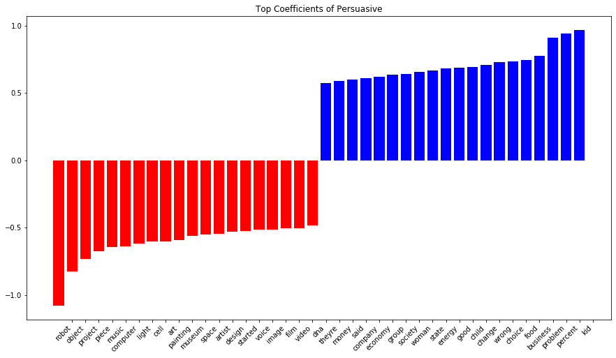
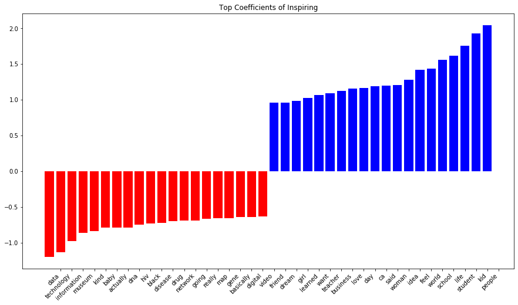
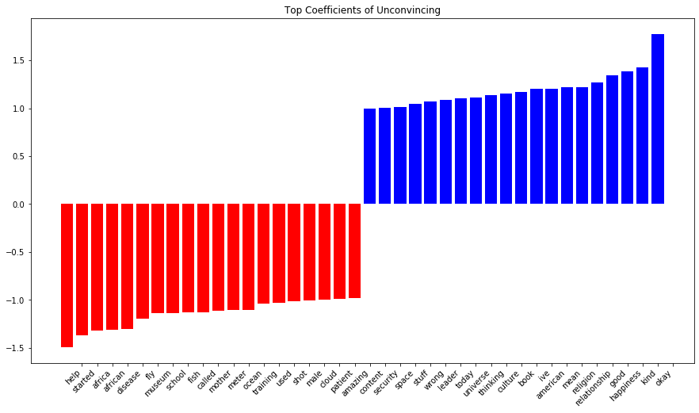
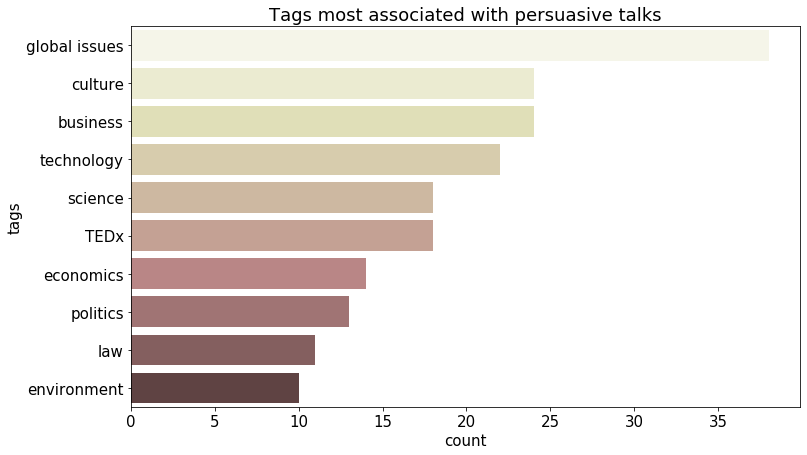
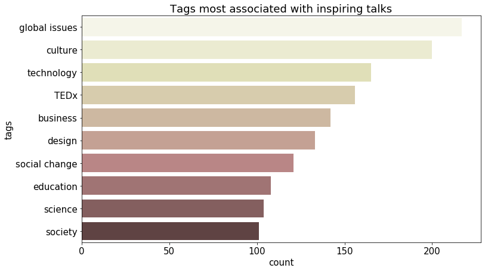
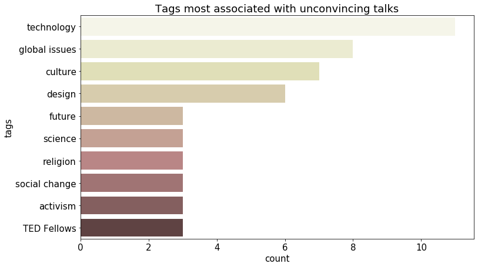
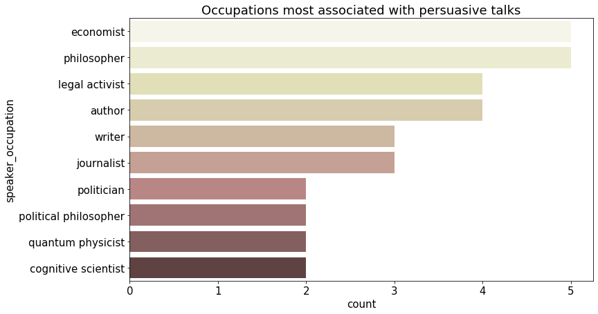
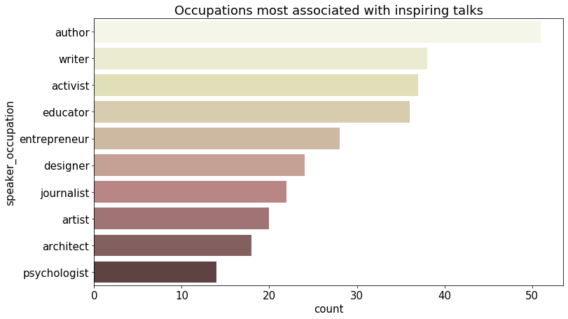
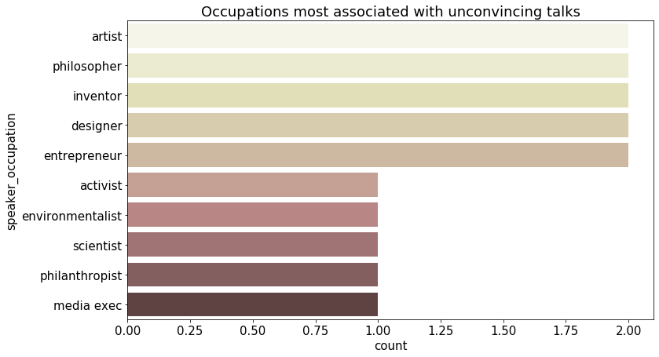
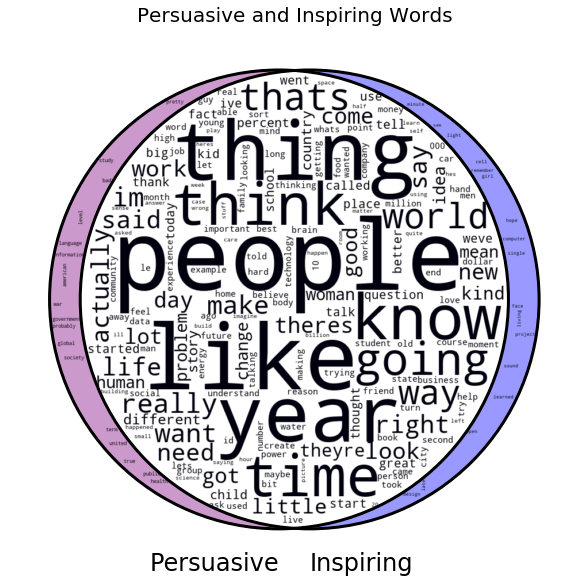

# Capstone Project: The Persuasive Power of Words
by Nee Bimin

### Problem Statement

We need to communicate to get our ideas across, whether it be at work or at home. The question is, how do we use words to persuade others to agree with our viewpoints? At the same time, we can also find out the words that are associated with being unconvincing and avoid them. 

In this project, the TED Talks data set from Kaggle (link: https://www.kaggle.com/rounakbanik/ted-talks) which contains ratings for persuasive, inspiring and unconvincing for each of the talks. These ratings are used as labels for the models. Binary classifiers will be deployed to classify transcripts as persuasive, inspiring and unconvincing. The models selected are:
* Support Vector Machine
* Random Forest
* Extreme Gradient Boosting (XGBoost)
* Multinomial Naive Bayes
* Logistic Regression 

Besides running binary classifiers, multilabel classifiers will also be run and the performance will be compared against the binary models. The following models will be run with a OneVsRestClassifier wrapper to allow for multilabel predictions:
* Support Vector Machine
* Naive Bayes
* Logistic Regression

To evaluate the models, the metric used is accuracy and we will compare it against the baseline accuracy. Accuracy is the proportion of true results among the total number of cases examined. Accuracy is chosen because the classes we have are well-balanced.

---

### Executive Summary

**Context/background**

Communication is key in our lives, both at home and at work. A big part of communication at the workplace is the art of persuasion, an important skill for leaders, client-facing roles and for day-to-day communication with colleagues. The ability to persuade and inspire is imperative for leaders to communicate their vision and to encourage buy-in to their new ideas. Client-facing roles need persuasiveness to win over the hearts of clients to become loyal customers.

**Business problem and objective/goal**

Many people fear the idea of presenting and having to convince others of their viewpoints especially when they first start out working. The objective of this project is to enable presenters to check their prepared script against the model through a website, which will rate the persuasiveness of the text. The long-term goal, however, will be to train the model such that it is able to give advice on phrasings and better words to use. 

**Source of data**

The data consists of TED Talks transcripts and other data such as ratings, occupations, etc. in the main dataset. These were obtained from Kaggle (link: https://www.kaggle.com/rounakbanik/ted-talks) and was web-scraped from the TED Talks website.

**Metrics and Baseline**

The metrics used is accuracy. Accuracy is used because the classes are well-balanced and we are interested in the proportion of true results. The naive persuasive classifier has a baseline accuracy of 0.50. The inspiring classifier also has a baseline accuracy of 0.50 while the unconvincing classifier has a baseline of 0.51.

**Model chosen and Findings**

The models run for binary classification were:
* Support Vector Machine
* Random Forest
* Extreme Gradient Boosting (XGBoost)
* Multinomial Naive Bayes
* Logistic Regression 

Besides running binary classifiers, multilabel classifiers were also run with a OneVsRestClassifier wrapper to allow for multilabel predictions:
* Support Vector Machine
* Naive Bayes
* Logistic Regression

Findings include:
**Top Coefficients of Persuasive Classifier**

The tags that come up most frequently for persuasive talks are global issues, culture and business so it is no surprise that the words related to global issues (e.g. problem) and business (e.g. percent, business) and culture (e.g. food) have made it to the top positive coefficients in persuasive talks.

**Top Coefficients of Inspiring Classifier**

The top inspiring words seem to be mainly focussed on education and we saw that educator is one of the top professions with talks voted inspiring.

**Top Coefficients of Unconvincing Classifier**

The top unconvincing word is 'okay', which may suggest that a neutral word like 'okay' does not leave much of an impression on the audience.

The model chosen is the Logistic Regression multilabel classifier because it generalised better than the rest of the models.

**Deployment**
The production model has been deployed on persuasively.herokuapp.com. A snapshot of the web app is included here:

---

### Exploratory Visualisations

Taking a look at the top tags or topics associated with the labels persuasive, inspiring and unconvincing will help us know if the content of the talk is the main reason behind the ratings given.

Common tags appear in all three types of talks. So it suggests that the topics of the talks are simply following the current trend and that topics are not the main driver behind the ratings given.

Next, we look at occupations to see if they are different across differently labeled talks.

In the top 5 occupations for persuasive and inspiring talks, we see author, writer and activist. Interestingly, philosophers take second place for both persuasive and unconvincing talks. However, most of the occupations associated with unconvincing talks are mainly in the creative domain e.g. artist, designer, inventor. 

To check if the hypothesis that persuasive and inspiring are closely related and hence, inspiring should be included in our modeling later, we look at a Venn diagram. 

This Venn diagram shows the overlapping words of persuasive and inspiring talks and we can see that most of the frequently occuring words for both talks are also part of the overlapping words.

### Pre-processing
* Tokenizer was used to return tokens before lemmatizing
* WordNetLemmatizer was used to remove stopwords and non-word characters

### Modelling

Binary classifiers were used to run separate classification models for persuasive, inspiring and unconvincing talks:

* Support Vector Machine
* Random Forest
* Extreme Gradient Boosting (XGBoost)
* Multinomial Naive Bayes
* Logistic Regression 

Besides running binary classifiers, multilabel classifiers were run with OneVsRestClassifier wrapper to allow for multilabel predictions:
* Support Vector Machine
* Naive Bayes
* Logistic Regression

After training the models, they were tested against unseen data - the top 40 all-time most persuasive speeches webscraped from https://highspark.co/famous-persuasive-speeches/. The speeches include "I Have a Dream" by Martin Luther King, "The Gettsyburg Address" by Abraham Lincoln and "Their Finest Hour by Winston Churchill".

The speeches are given labels of 1 for persuasive and inspiring but are not tested for unconvincing because what may be unconvincing to some may not be unconvincing to others. 

---

### Conclusion

#### Production Model
The production model is the TfidfVectorizer Logistic Regression with OneVsRestClassifier with the following parameters:

stop_words = 'english'
ngram_range = (1,2)
solver = 'sag'
C = 0.1
The reason for the model's poor performance against the unseen data chosen could be the different context and words used in TEDTalks as opposed to the top 40 most inspiring speeches of all time, which tend to be political in nature.

Even though the performance against the unseen data was not satisfactory, the model beat the baseline score and is one of the better ones in generalising to unseen data.

#### Limitations
1. TEDTalks can have a wide focus, so in order to deploy it for the purpose of making business presentations/pitches more persuasive, we require more specific data on businesses in different industries because they have different jargons that can be useful to be learned by the model.

2. There could be other predictors of persuasiveness apart from what is captured in the transcripts. Examples include:
    * **Currency of topics of speech**: As we have seen in the top 40 speeches, they include speeches by Martin Luther King, Nelson Mandela and the likes. The political context plays a large role in persuasion and inspiration because it is already a topic most people feel strongly about at that point in time.
    * **Profession**: We saw in the earlier EDA that different careers are associated with being persuasive/ inspiring (authors, economists, activists, educators) and unconvincing (artists, inventors, designers). Given that the tags/ topics associated with all three talks are roughly the same, the difference could come either in either the words they use or the way the words are phrased. Those who are unconvincing tend to be from creative professions, which perhaps do not require much word exchanges at work. 
    * Other predictors could be **tone, gender, duration of talk**, etc.

3. We could also tweak the use of data. In this project, the label of 1 are given when a talk receives more than the median number of votes for that particular category (i.e. if talk 1 has x number of votes on unconvincing, which is higher than the median number of votes for unconvincing, it will be labeled as unconvincing). While this ensures that each class is balanced, it does not help with the fact that there are actually many more votes for inspiring and persuasive compared to unconvincing. So the model could be less accurate for unconvincing class because it is easier for a talk to qualify as being unconvincing than inspiring or persuasive. 

### Future Works
The limitations in the data used can be addressed in future works. The deployability depends on the industry. If the model were to be deployed in technology-related industry, speeches could be filtered based on tags and the model could be trained only on technology-related talks. For higher accuracy, better data such as pitches or presentations made in business meetings could be used instead.

---
